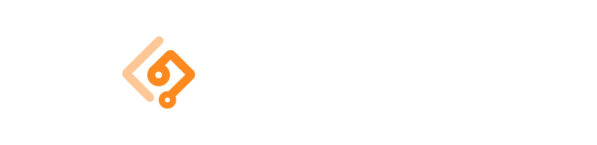

 

  <a href="https://www.devasign.com" style="display: block; margin: 0 auto;">
    <picture>
      <source media="(prefers-color-scheme: dark)" srcset="./public/readme-cover-nobg.png">
      <source media="(prefers-color-scheme: light)" srcset="./public/readme-cover.png">
      
    </picture>
  </a>
 

 

  <strong style="font-size: 16px;">Backed by</strong> 

DevAsign streamlines open-source project management by automating contributor payments and intelligently handling pull requests with advanced AI review.

## Community

[Join our Discord!](https://discord.com/channels/1335941257155055688/1335941257641328743) We are here to answer questions and help you get the most out of DevAsign.

## Contributing

We welcome community contributions. For guidelines, refer to our [CONTRIBUTING.md](/CONTRIBUTING.md).

## License

Attribution-NonCommercial 4.0 International, see [LICENSE](https://github.com/devasignhq/devasign-api/blob/main/LICENSE).
