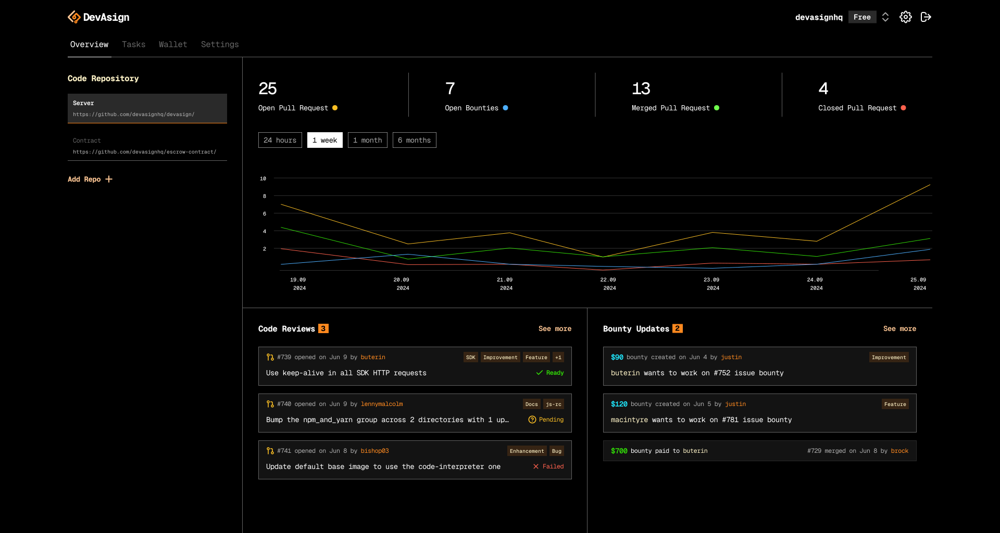

<br/>
<div align="center">
  <a href="https://www.devasign.com?ref=github" style="display: block; margin: 0 auto;">
    <picture>
      <source media="(prefers-color-scheme: dark)" srcset="./public/devasign-white.png">
      <source media="(prefers-color-scheme: light)" srcset="./public/devasign-black.png">
      
    </picture>
  </a>
<br/>

<br/>
</div>
<br/>

<div align="center">
    <a href="https://github.com/devasignhq/maintainer-app?tab=Apache-2.0-1-ov-file">
  
<a href="https://GitHub.com/devasignhq/maintainer-app/graphs/contributors">
  
</a>
<a href="https://devasign.com">
  
</a>
</div>
<div>
  <p align="center">
    <a href="https://x.com/devasign">
      
    </a>
    <a href="https://www.linkedin.com/company/devasign">
      
    </a>
  </p>
</div>


<div align="center">
  DevAsign helps open-source project maintainers spend more time building great software and less time on administrative tasks. 
  
  Uses AI to review PRs - filtering out low-quality submissions; Provides intelligent feedback helping developers improve their code before maintainer review; Handles bounty payouts when code gets merged.

  **Join our stargazers :)** 

  <a href="https://github.com/devasignhq/maintainer-app">
    
  </a>

  <br/>
  </div>
  <br/>

  <a href="https://www.devasign.com?ref=github" style="display: block; margin: 0 auto;">
      <picture>
        
      </picture>
    </a>
  </div>

## What This App Does

The DevAsign Maintainer App is the frontend interface for project maintainers to:

- **Create & Manage Bounties**: Install DevAsign app on project repo. Add bounties to issues/tasks.
- **Monitor AI Reviews**: Oversee AI-powered pull request analysis and merge decisions.
- **Track Contributors**: View contributor activity and reputation scores.
- **Manage Payments**: Process bounty payments on-chain through the Stellar blockchain network.
- **Configure Workflows**: Set up project-specific rules and automated approval thresholds.
- **Team Collaboration**: Manage team members and project settings.
  
## Tech Stack

- **Framework**: Next.js 15 with React 19
- **Language**: TypeScript
- **Styling**: Tailwind CSS
- **State Management**: Zustand
- **Authentication**: Firebase Auth
- **HTTP Client**: Axios
- **Forms**: Formik with Yup validation
- **UI Components**: Custom components with React Icons

## Prerequisites

#### Required Software
- **Node.js** (version 18.0 or higher)
- **npm** (version 8.0 or higher) or **yarn** (version 1.22 or higher)
- **Git** (latest version)

#### Required Accounts & Services
- **DevAsign API Server** - Backend server must be running (see [server setup](https://github.com/devasignhq/devasign-api/))
- **Firebase Project** - for authentication services

## Installation & Setup

#### Step 1: Clone the Repository
```bash
git clone https://github.com/devasignhq/app.devasign.com.git
cd app.devasign.com
```

#### Step 2: Install Dependencies
```bash
# Using npm
npm install

# Or using yarn
yarn install
```

#### Step 3: Environment Configuration
1. Copy the example environment file:
```bash
cp .env.example .env.local
```

2. Configure your `.env.local` file with the following variables:
```bash
# Firebase Configuration
NEXT_PUBLIC_FIREBASE_API_KEY="your-firebase-api-key"
NEXT_PUBLIC_FIREBASE_AUTH_DOMAIN="your-project.firebaseapp.com"
NEXT_PUBLIC_FIREBASE_PROJECT_ID="your-project-id"
NEXT_PUBLIC_FIREBASE_STORAGE_BUCKET="your-project.appspot.com"
NEXT_PUBLIC_FIREBASE_MESSAGING_SENDER_ID="123456789"
NEXT_PUBLIC_FIREBASE_APP_ID="1:123456789:web:abcdef"
NEXT_PUBLIC_FIREBASE_MEASUREMENT_ID="Q-SFQEFEEWEE"

# API Configuration
NEXT_PUBLIC_API_BASE_URL="api-url"

# App Configuration
NEXT_PUBLIC_NODE_ENV="development"
```

#### Step 4: Start the Development Server
```bash
# Start the development server
npm run dev

# The app will be available at http://localhost:3000
```

## Running the Application

#### Development Mode
```bash
# Start with Turbopack (faster builds)
npm run dev
```

#### Production Mode
```bash
# Build the application
npm run build

# Start production server
npm start
```

## Configuration

#### Firebase Setup
1. Create a new Firebase project at [Firebase Console](https://console.firebase.google.com/)
2. Enable Authentication and choose GitHub as your preferred sign-in method
3. Get your Firebase configuration from Project Settings
4. Add the configuration values to your `.env.local` file

#### API Server Connection
1. Ensure the DevAsign API server is running (see [server setup](https://github.com/devasignhq/devasign-api/))
2. Update `NEXT_PUBLIC_API_BASE_URL` in your `.env.local` to point to your API server
3. Verify the connection by checking the health endpoint at `/health`


<!-- ## 🚀 Deployment -->

<!-- ## 🤝 Contributing -->

## License

DevAsign is open-source software licensed under the Apache 2.0 License. See [LICENSE](https://github.com/devasignhq/app.devasign.com/blob/main/LICENSE) for more details.

## Repo Activity


## Related Projects

- [DevAsign API Server](https://github.com/devasignhq/devasign-api) - Backend API and AI engine
- [DevAsign Contributor App](https://github.com/devasignhq/contributor.devasign.com) - Frontend for contributors
- [Soroban Task Escrow Contract](https://github.com/devasignhq/soroban-contract) - Task Escrow Management

<!-- ## 💬 Community -->
